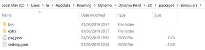
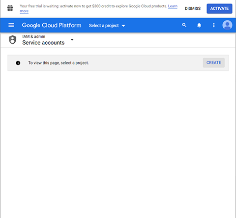
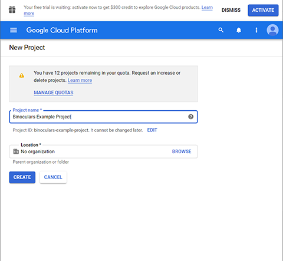
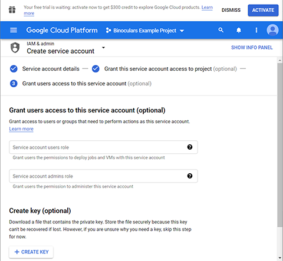
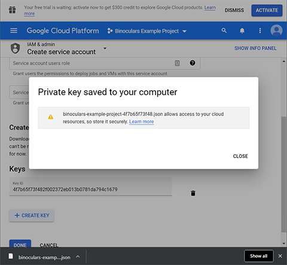
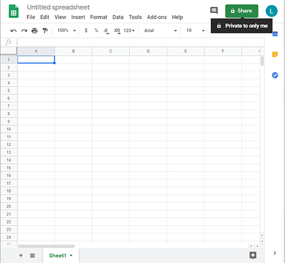
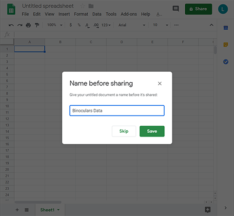
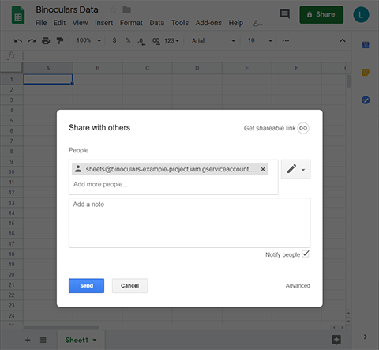
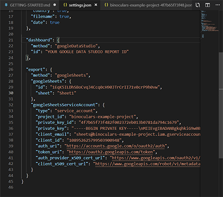

# Getting Started with Binoculars

For this Getting Started Guide we're assuming you want to use Google Sheets to store the log data recorded from Binoculars and then visualise it within Google Data Studio.

## Download Binoculars

Download Binoculars and save it to the packages folder for your version of Dynamo and whether you run Dynamo within Revit.



If you just use Dynamo Sandbox it could be either:
```
%appdata%\Dynamo\Dynamo Core\2.0\packages\
%appdata%\Dynamo\Dynamo Core\2.1\packages\
```

And if you run Dynamo from Revit try:
```
%appdata%\Dynamo\Dynamo Revit\2.0\packages\
%appdata%\Dynamo\Dynamo Revit\2.1\packages\
```

If you use Dynamo in multiple contexts then copy the package to each directory.

## Google Cloud Platform Service Account

First we need to set up a Google Cloud Platform Service Account to authenticate access to Google Sheets.

Open the following link:
[http://console.cloud.google.com/iam-admin/serviceaccounts/create](http://console.cloud.google.com/iam-admin/serviceaccounts/create)


Agree to the terms and conditions.





Create a project. You can call it anything you like.


Now, create a Service Account.

If you've ended up on a different page then just follow the link again:
[http://console.cloud.google.com/iam-admin/serviceaccounts/create](http://console.cloud.google.com/iam-admin/serviceaccounts/create)

You can call it anything you like but keep it simple.


Now, you'll be asked to assign permissions to the Service Account. We don't want to add any so just press continue.



Now, we don't want to Grant any users access to this Service Account but we do want to create a key.


Select JSON for the key type.



The key will now be downloaded. We don't need it just yet so save it somewhere memorable.

Click done to return to the Service Accounts index on Google Cloud Platform.


You should now see the Service Account we've just created. Copy the email address to your clipboard.

## Google Sheets

Next we will create the Google Sheet where your data will be stored.

Open Google Drive with the following link.
[https://drive.google.com/drive/](https://drive.google.com/drive/)


Create a new Google Sheet.



Press Share.



Give the document a name.



Now paste the email address for the Google Cloud Platform Service Account and press send.

That's great! Our Service Account can now edit the Google Sheet.

## Updating Binoculars settings.json

It's now time to edit `settings.json`.


Return to the directory you saved the Binoculars package to and open the `settings.json` file within it.


I've opened it in Visual Studio Code here but you can just as easily edit it in Notepad or another text editor.

Scroll down to the `export` section.



Copy the Google Sheet `id` from the url of your Google Sheet file as seen in the screenshot above. 

Now add the `sheet` name as seen in the screenshot above. Assuming you haven't changed it, this is probably just `Sheet1`.

Finally, copy and paste the values from the Service Account credentials `.json` file we downloaded earlier into the `googleSheetsServiceAccount` section.

The file should now look similar to this image above. I've blacked out some details which should be kept secret.

Save the `settings.json` file.

Be sure to copy your `settings.json` changes to all the other contexts you use Dynamo as shown in the first step.

## Binoculars

Binoculars should now be configured so open it and give it a test!

## Google Data Studio

To be continued...