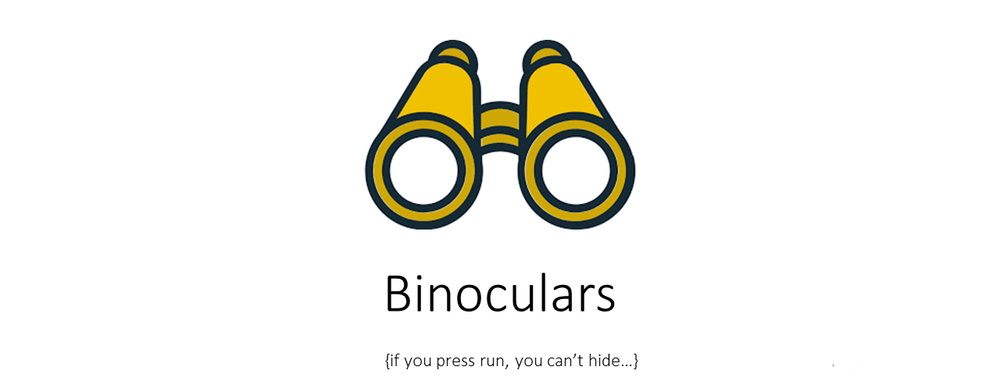
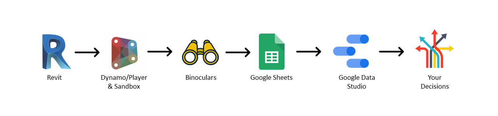
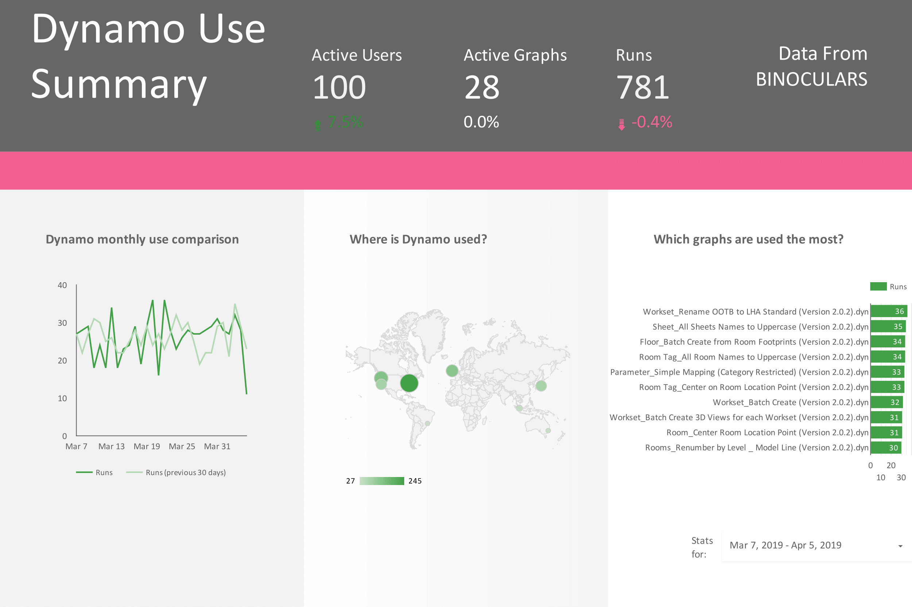
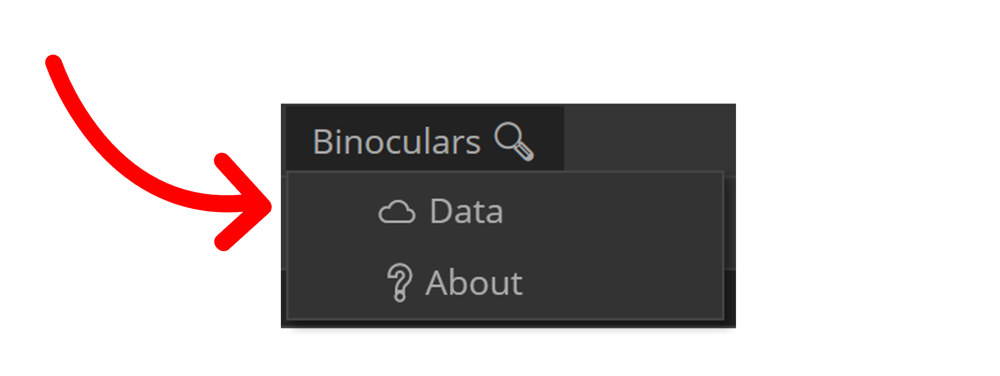

________________

### What

Binoculars is a view extension for Dynamo that records the use of scripts and graphs providing your organisation or design practice insight into the use of Dynamo in your computational design workflows.

Binoculars started life at the Dynamo and Generative Design Hackathon in London, 2019 where it was awarded first place. To learn more [read our post on the Dynamo Blog](https://dynamobim.org/london-hackathon-binoculars/) or [watch the 4 minute Hackathon presentation](https://youtu.be/X_LNTIqhLPk?t=2492).

### Why

**Strategic Management**: to help others understand where and how Dynamo is used, what the financial benefit and return on invest is, to identify bottlenecks, and strategic risk allocation.

**Tactical Management**: to identify the most commonly used scripts and who the local dynamo champions are – breaking down knowledge silos.

**Operational Management**: to monitor where outdated versions of software and scripts are being used, to see which scripts are most or least popular and what dynamo is most commonly used for.

### Getting Started

We've developed an indepth Getting Started Guide to walk you through the steps to download, install, and configure the latest release of Binoculars for your version of Dynamo so you can easily integrate it into your organisation.

- [Getting Started Guide](GETTING-STARTED.md)
- [Latest Releases](https://github.com/teamtreedyn/Binoculars/releases)

If you're looking to build Binoculars from source in Visual Studio then please refer to [The Contributors' Guide](https://github.com/teamtreedyn/Binoculars#build-from-source) at the bottom of the README.

### How

The full history and methodology of Binoculars is told in [our post on the Dynamo Blog](https://dynamobim.org/london-hackathon-binoculars/). Go check it out, it's illustrated wth some of the best GIFs ever made.

Binoculars runs as a view extension in Dynamo and logs data whenever a graph is run by hooking in to the `OnEvaulationCompleted` event.

Binoculars captures a variety of data at two points. First on startup of dynamo user and environment data is collected, including Geolocation by IP using ipinfo.io. Second, data specific to the graph in use is collected after the graph has been run.

The logs can then be stored using a variety of mechanisms such as to a CSV on a file server or to your organisation's cloud. The methodology followed at the Hackathon and currently built in to Binoculars is to store the Data in Google Sheets and then visualise that data on dashboards on a series of dashboards in Google Data Studio. Further methods for [data storage](https://github.com/teamtreedyn/Binoculars/issues?q=is%3Aissue+is%3Aopen+label%3A%22data+storage%22) and [data visualisation](https://github.com/teamtreedyn/Binoculars/issues?q=is%3Aissue+is%3Aopen+label%3A%22data+visualisation%22) are planned for the future.

### Contributing

Binoculars began life as a community project arising out of the UK Dynamo User Group Hackathon, April 2019. Feel free to make suggestions through pull requests, track and submit bugs through issues.

### Building from Source

1. Either clone the repository with git or download the source as [a zip](https://github.com/teamtreedyn/Binoculars/archive/master.zip).

2. Open [Binoculars.csproj](Binoculars.csproj) in a text editor and ensure the `DeployFolder` is [correctly set](https://github.com/teamtreedyn/Binoculars/commit/ac088bd3fe5c027b6c0cc8e35185bcba1296953e#diff-fec7353f03ce00d43d7df2154ba6bfc4L179-L181) for your version of Dynamo. This currently defaults to `v2.1`.

3. Open the `.sln` with Visual Studio and make sure all References are set correctly.

4. Follow steps 2 onwards of [The Getting Started Guide](GETTING-STARTED.md) to configure Binoculars.

5. Compile Binoculars in Visual Studio by pressing run. Wait a moment as it compiles. Dynamo should then [launch itself](https://github.com/teamtreedyn/Binoculars/commit/f1d95feb65e062e51180b4129466e29a786596a1#diff-37951fdf0b7fcbedc8a257b49641dcf3R17) and if successful you should see Binoculars at the end of the menu bar at the top of the Dynamo interface. Now, when you run a Graph, you should see a new entry appear in your Google Sheet.

6. Tap yourself on the shoulder.

*Visualising the data* we've created a template in Google Data Studio that can be connected to your Google Sheet to show your results.

#### Disclaimer

Sharing your Google Account credentials and private keys will expose the Google account associated with it in some ways. Please, investigate the concept before commiting further. Using a neutral Google account might be the best option if you don't understand the repercussions of using Google API fully.

### How we got here

Building on the python code presented by Olly Green of AHMM at UKDUG meeting on 19th of February 2012.
Further developed by Wayne Patrick Dalton and Brendan Cassidy.

The initial version of this extension was developed by Wayne Patrick Dalton, Laurence Elsdon, Deyan Nenov, Caoimhe Loftus, over a period of two days during the UKDUG Hackathon April 2019.

Building on the extensions workshop by Radu Gidei of Enstoa, we decided that an extension was the best way to deploy Binoculars.
Rather than relying on the graph user to add a custom/zero touch node to their script - or not to delete it! - the extension triggers when any Dynamo graph is run*. This extension can be installed via the local IT team without any depending on user input.

Binoculars appears as a drop down on the menu bar, with information about the information that is being collected, and access to the report produced from the data collected.

Obviously any data monitoring has GDPR (or similar!) implications so we built in a popup that makes the user aware that their data is being tracked.

The code can be broken down into 3 main pieces

- UI elements including privacy screen on startup
- Collecting the data, done on 'evaluation complete'
- Publishing the data collected using Post Request to Google Sheets

________________

### The Sample Data

As a side exercise to help us visualise the data we were expecting to get from Binoculars we wrote a dynamo graph to produce a sample data set.

Collecting a sample set of information from the internet, we used python nodes to generate and randomise a series of outputs.

The Sample Data graph is available in [its dedicated repository](https://github.com/teamtreedyn/BinocularsSampleData/).

__________________

*We propose that in future version of Binoculars the GDPR notifications can be edited to appear at designated time intervals instead of at every use
